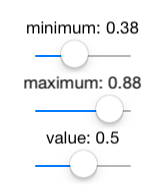
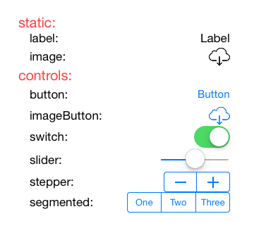

# Dialog

Declarative, code-driven user interfaces and applications in F#. Inspired by [React](http://facebook.github.io/react/).

License will be BSD.

## Motivation

Conceptually, Dialog is new in many respects:

- First, and most importantly, Dialog introduces an almost pure functional component system, which is conceptually simpler to understand than lenses or monads. Though not implemented as such, the component system is equivalent to a [term rewriting system](http://en.wikipedia.org/wiki/Rewriting).
- Dialog allows user interfaces to be specified in a declarative way. A specification always looks similar to the content that is presented on the screen.
- Dialog introduces an internal DSL, which is comparable to other external DSLs/XML grammars for specifying user interfaces. F#'s list comprehensions seemed to be a great fit and turned out to be more readable and more flexible than XML, or React's JSX for that matter.
- Dialog combines statically typed properties with the flexibility to pass them around in dynamically typed lists and extract them back when needed. This combines the flexibility of dynamically typed programming languages with the strength of statically typed ones.
- Dialog's component model supports multiple hierarchies of independent subtrees of functionality. For example a nested component may present a popover at any time by rendering it somewhere in its view hierarchy. The popover does not affect the primary view hierarchy, but gets picked up by an independent service, that scans over the component hierarchy and shows the popover when needed. This extensibility mechanism may be capable to support the specification of a complete application, not only its user interface.

## Examples

- [Interaction](https://github.com/pragmatrix/Dialog/blob/master/Dialog.iOS.UI.Tests/InteractionTests.fs)   

- [Standard Controls](https://github.com/pragmatrix/Dialog/blob/master/Dialog.iOS.UI.Tests/StandardControls.fs)   

- [Popover](https://github.com/pragmatrix/Dialog/blob/master/Dialog.iOS.UI.Tests/PopoverTests.fs)

## Vision

- Dialog's declarative component system is suited towards live programming. The author is planning to use [NCrunch](http://www.ncrunch.net/), an automated testing framework, with [Nessos.Vagabond](http://nessos.github.io/Vagabond/), a library that supports the dynamic distribution of .NET code, to create a tool that supports state preserving and live user interface previews while typing.
- One, free, community driven, user interface framework for all platforms. Mobile first.

## Status

- Layout is based on a C# port of [Facebook's css layout](https://www.github.com/pragmatrix/css-layout).
- The API is not yet stable, naming changes and conceptual redesigns will follow.
- A bunch of iOS controls are implemented, not much more. 
- The project compiles in Visual Studio + Xamarin.iOS, but not yet in Xamarin Studio, because of a [bug](https://bugzilla.xamarin.com/show_bug.cgi?id=27744).

## Roadmap 1.0

- Support most iOS controls, including scroll and list view containers.
- Async support for actor-like components, support timers, and state changes that are triggered be triggered by external events.
- Be sure the API is stable and internal types and functions are protected properly.
- Cache the component's render output.

## And then

- Support most Windows Apps and Android controls.
- Components for specifying the application and navigation. Popovers are already available.
